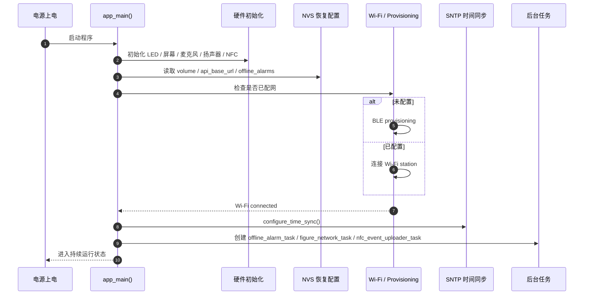
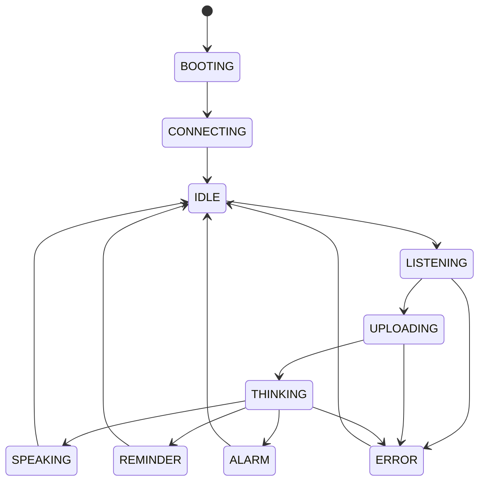
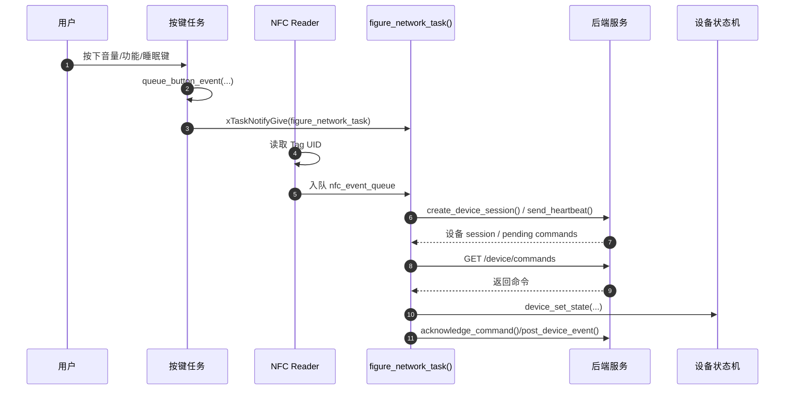
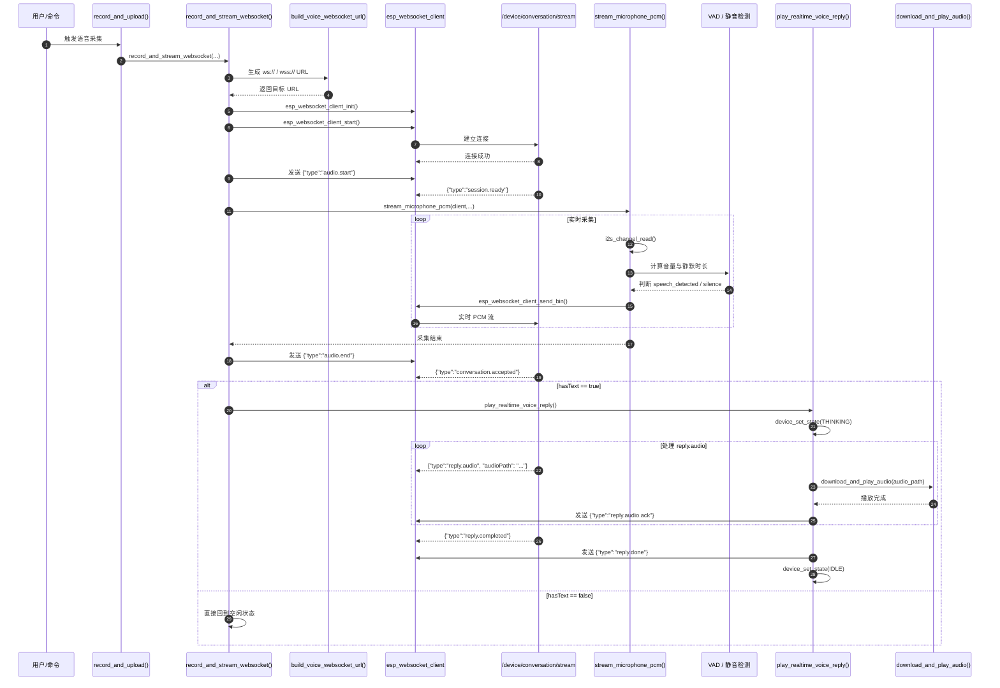
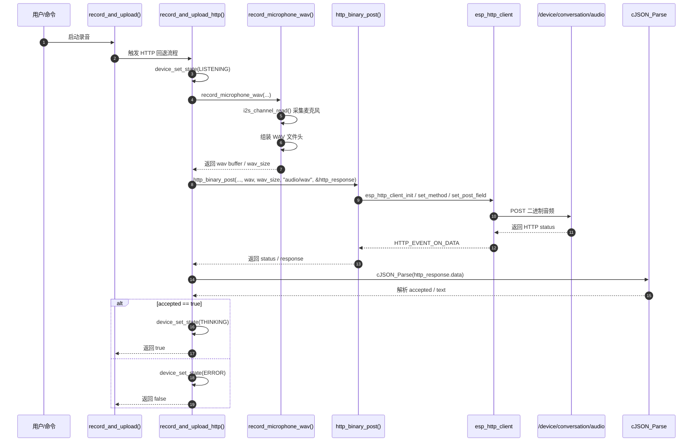
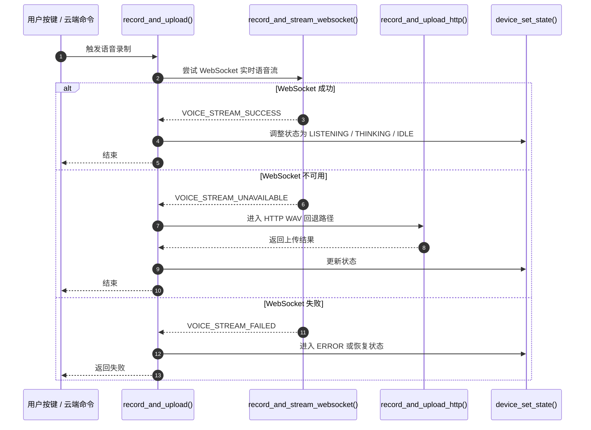

# Figure 设备音频上传与生命周期说明

本文整理了 ESP32 设备端的核心生命周期，以及两条主要音频上传链路：

- WebSocket 实时语音流
- HTTP WAV 文件上传

这两条链路在源码中由统一入口 `record_and_upload(...)` 负责调度，优先走 WebSocket，失败时自动回退到 HTTP。

---

## 1. 程序整体生命周期

### 1.1 启动流程（`app_main()`）

程序入口位于 `app_main()`。启动时会依次执行：

- 初始化 RGB LED、显示屏、麦克风、Speaker、NFC 等硬件
- 执行板载自检
- 初始化 NVS，恢复音量、API 地址、离线闹钟
- 配置按键 GPIO
- 若设备未完成 Wi‑Fi 配置，则进入 BLE Provisioning 流程
- 若已完成配置，则进入 Wi‑Fi station 模式
- 等待 Wi‑Fi 连接成功
- 启动 SNTP 时间同步
- 创建后台任务：
  - `offline_alarm_task()`
  - `figure_network_task()`
  - NFC 事件上传任务

### 1.2 运行流程（状态机）

程序核心是 `device_state_t` 状态机，典型状态包括：

- `DEVICE_STATE_BOOTING`
- `DEVICE_STATE_CONNECTING`
- `DEVICE_STATE_IDLE`
- `DEVICE_STATE_LISTENING`
- `DEVICE_STATE_UPLOADING`
- `DEVICE_STATE_THINKING`
- `DEVICE_STATE_SPEAKING`
- `DEVICE_STATE_REMINDER`
- `DEVICE_STATE_ALARM`
- `DEVICE_STATE_ERROR`

其中 `device_set_state(...)` 负责统一切换状态，并同步更新：

- `device_state`
- `device_state_since`
- RGB LED 颜色
- 显示屏状态
- 日志输出

### 1.3 事件流（按键 / NFC / 云端命令）

后台的 `figure_network_task()` 是核心调度器，主要职责包括：

- 生成/刷新设备 session
- 发送 heartbeat
- 拉取 `/device/commands`
- 执行云端命令
- ack 命令完成
- 上报本地按钮事件和 NFC 事件

---

## 2. WebSocket 实时语音上传时序

### 2.1 主流程

当用户按下对话键，或者云端发起语音任务时，程序进入统一入口：

- `record_and_upload(...)`
- `record_and_stream_websocket(...)`

主要逻辑如下：

1. 建立 WebSocket 连接到 `/device/conversation/stream`
2. 发送 `audio.start`
3. 调用 `stream_microphone_pcm(...)` 读取麦克风 PCM
4. 进行 VAD（静音/语音检测）
5. 分块通过 WebSocket 发送 PCM
6. 发送 `audio.end`
7. 服务端返回 `conversation.accepted`
8. 若 `hasText == true`，则进入 `play_realtime_voice_reply(...)`
9. 播放返回 `reply.audio`
10. 发送 `reply.audio.ack`
11. 完成后发送 `reply.done`

### 2.2 关键函数

- `build_voice_websocket_url(...)`
  - 将 `api_base_url` 转换成 `ws://` 或 `wss://` 语音流地址
- `voice_websocket_event(...)`
  - 处理 `CONNECTED / DATA / ERROR / DISCONNECTED`
  - 通过 EventGroup 同步状态位
- `stream_microphone_pcm(...)`
  - 读取 PCM
  - 执行 VAD
  - 主动发送音频二进制数据
- `play_realtime_voice_reply(...)`
  - 接收服务端返回的复述音频
  - 有序播放并 ACK

---

## 3. HTTP WAV 上传时序

### 3.1 回退机制

当 WebSocket 不可用、连接失败或返回错误时，程序会自动回退到：

- `record_and_upload_http(...)`
- `record_microphone_wav(...)`
- `http_binary_post(...)`

这是一条更稳妥的备用链路。

### 3.2 关键函数

- `record_microphone_wav(...)`
  - 把 PCM 组装成合法 WAV 文件
- `http_binary_post(...)`
  - 发送二进制音频内容
- `http_event_handler(...)`
  - 收集 HTTP 返回体
- `cJSON_Parse(...)`
  - 解析 `accepted` 与识别文本

---

## 4. 时序总结：统一入口调度逻辑

这一层设计体现了整个项目的本质：

- 优先低延迟实时交互
- 降级到稳定的 HTTP 上传
- 统一状态机控制运行状态
- 通过事件驱动和队列处理异步上传/回放

---

## 5. 结论

这份代码不是传统意义上的“单线程顺序流程”，而是典型的 ESP32 多任务 + 状态机设计：

- 启动初始化
- Wi‑Fi 配网
- Session 建立
- 心跳与命令同步
- 实时语音采集
- WebSocket 或 HTTP 上传
- 音频播放
- 离线闹钟与状态恢复

核心函数可以概括为：

- `app_main()`
- `device_set_state()`
- `figure_network_task()`
- `record_and_upload()`
- `record_and_stream_websocket()`
- `record_and_upload_http()`
- `offline_alarm_task()`

该设计兼顾了：

- 低延迟实时交互
- 稳定的降级能力
- 云端命令驱动
- 本地状态机管理
- 自恢复与异常处理

因此，它更像是一个“云端命令驱动 + 本地事件驱动 + 状态机控制”的智能音频设备运行模型。

---

如果你需要，我还可以继续把这份文档整理成：

1. 更适合 README 的精简版
2. 更适合发给团队的汇报版
3. 带中文注释的函数级时序图版本
